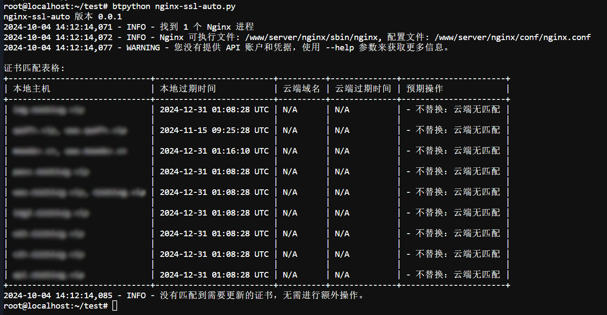
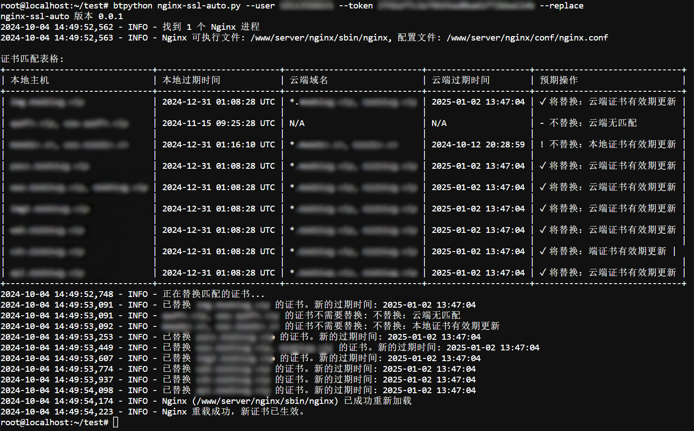

# nginx-ssl-auto

nginx-ssl-auto 是一个自动化工具，用于管理和更新 Nginx 服务器上的 SSL 证书。它可以检测本地证书，与云端证书进行比较，并在需要时自动更新证书。

云端证书源基于[来此加密](https://letsencrypt.osfipin.com/jump/share?code=ND8WP8WR)

## 功能特点

- 自动检测运行中的多个 Nginx 进程及其配置文件
- 解析 Nginx 配置文件以找到 SSL 证书路径
- 获取本地证书的过期时间与云端证书进行比较
- 自动替换需要更新的证书
- 自动重载 Nginx 配置
- 备份和检测机制

## 安装

1. 克隆仓库：
   ```
   git clone https://github.com/verymoe/nginx-ssl-auto.git
   ```

2. 进入项目目录：
   ```
   cd nginx-ssl-auto
   ```

3. 安装依赖：
   ```
   pip install psutil cryptography requests prettytable
   ```

## 使用方法

基本用法：

```
python nginx-ssl-auto.py [选项]
```

选项：
- `--user USER`: API 用户名
- `--token TOKEN`: API 令牌
- `--replace`: 替换匹配的证书
- `--debug`: 启用调试模式
- `--version`: 显示版本信息

提示：
- 证书申请：在来此加密自行完成，本脚本只实现证书自动化替换更新。
- 令牌获取：来此加密→登录→我的→API接口→创建新TOKEN。
- 用户名：来此加密登录用户名，邮箱或绑定手机号。

示例：

1. 仅查看本地证书信息：
   ```
   python nginx-ssl-auto.py
   ```
   
2. 检查并更新证书：
   ```
   python nginx-ssl-auto.py --user your_username --token your_token --replace
   ```

   

3. 使用调试模式运行：
   ```
   python nginx-ssl-auto.py --debug
   ```

## 注意事项

- 请确保在运行脚本之前已经了 Nginx
- 使用 `--replace` 选项时请小心，它会直接修改您的证书文件
- 建议在首次使用时先不带 `--replace` 选项运行，以查看将会进行的操作
- 如果遇到问题，请使用 `--debug` 选项来获取更详细的日志信息

## TODO List
- [ ] 研发私有证书源（计划寒假闲了开发）
- [ ] 消息推送：webhook/smtp
- [ ] 工具使用次数统计

## 贡献

欢迎提交问题报告和拉取请求。对于重大更改，请先打开一个问题讨论您想要改变的内容。